# Vector CANoe Highlevel Understanding

## CANoe Concept

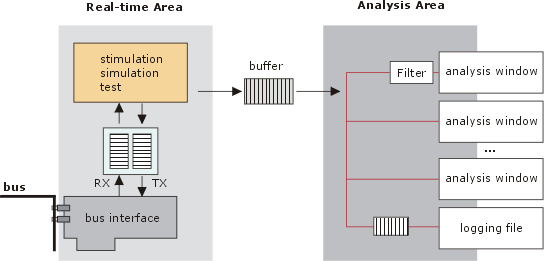

## Simulation Concept

## Analysis Concept

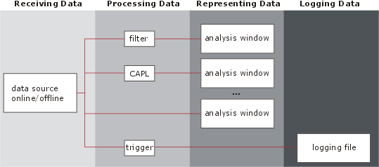

### Trace Window

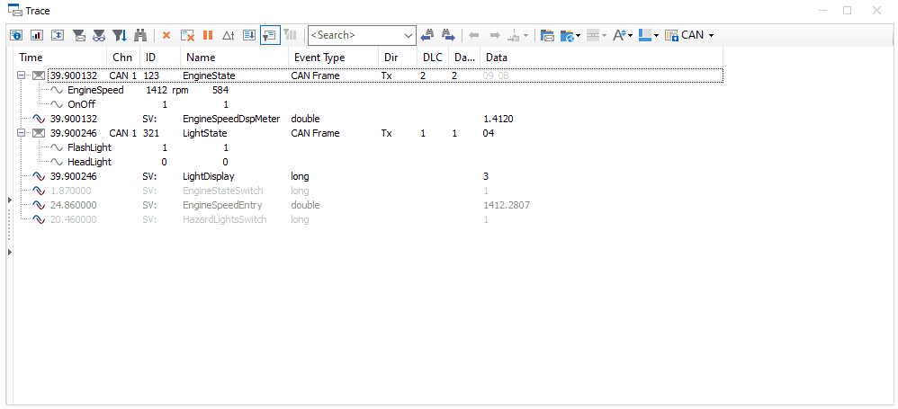

### Graphic Window

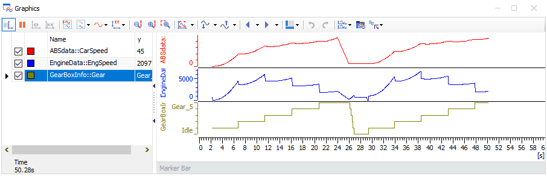

### Bus Statistics Window

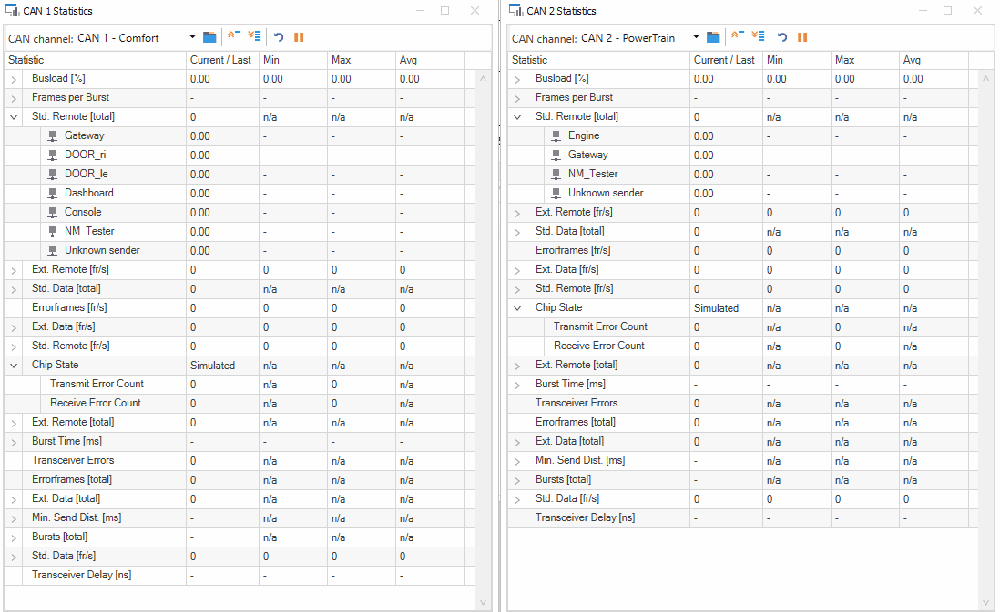

### State Tracker Window

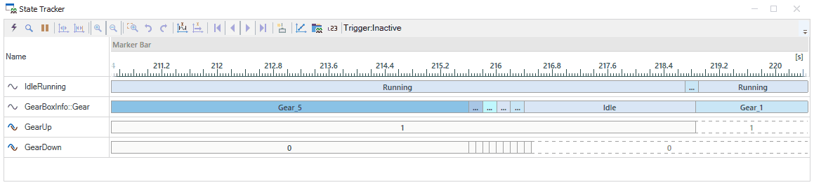

### Data Window

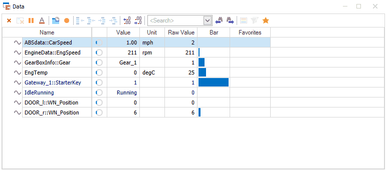

## Test Concept

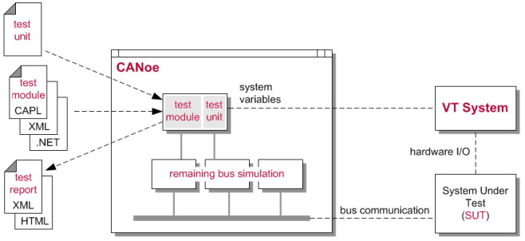

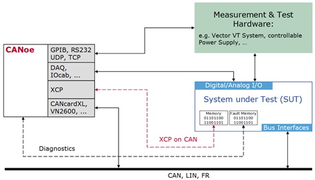

## Diagnostics Concept

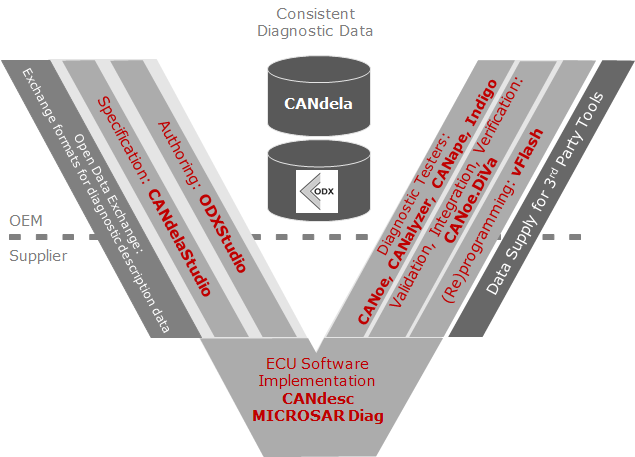

## COM Object Hierarchy

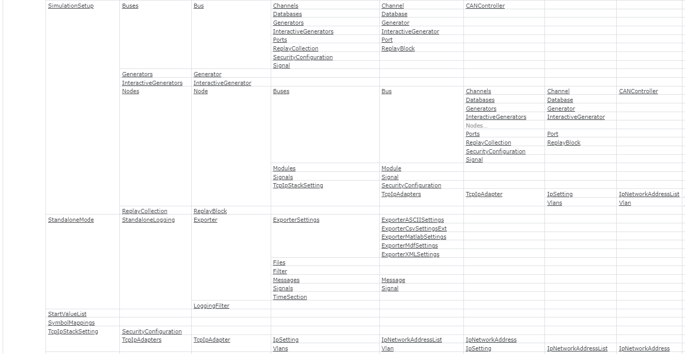
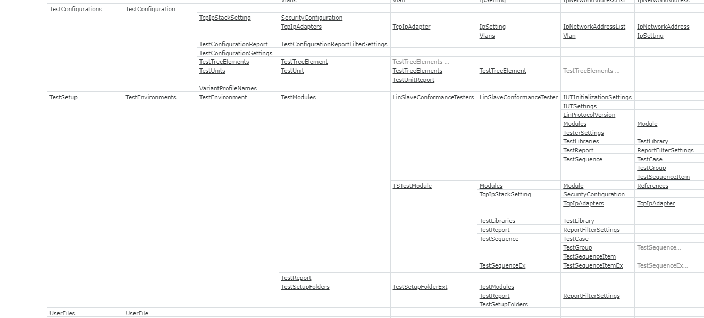

## Examples

### create new CANoe configuration

