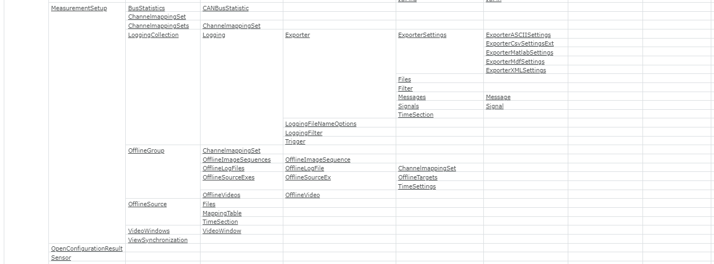
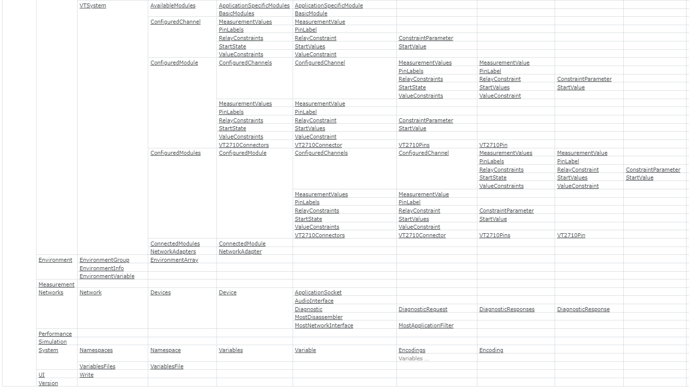

# Vector CANoe Highlevel Understanding

## CANoe Concept

## Simulation Concept

## Analysis Concept

### Trace Window

### Graphic Window

### Bus Statistics Window

### State Tracker Window

### Data Window

## Test Concept

## Diagnostics Concept

## COM Object Hierarchy

## Examples

### create new CANoe configuration

